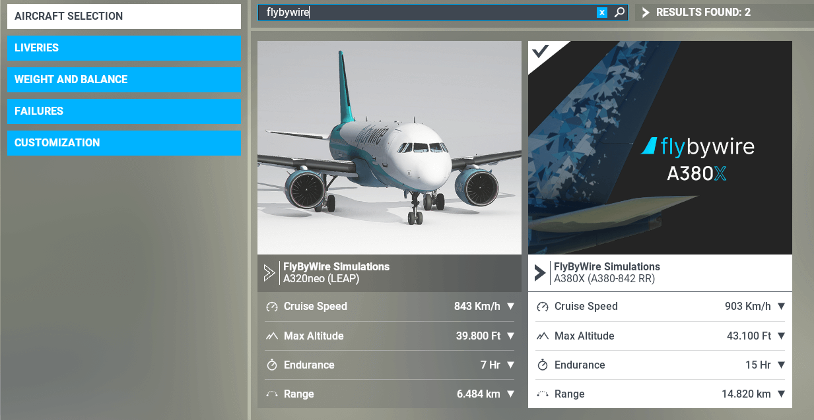

## General

???+ info "Q: Where are our planes in-sim?"
    Both of our aircraft are searchable in the aircraft selection menu. 

    

    - The A32NX is listed as `FlyByWire Simulations A320neo (LEAP)`

    - The A380X is listed as `FlyByWire Simulations A380X (A380-842R RR)`

    !!! tip "A32NX"
        The A32NX is a separate aircraft from the default Asobo A320. 

        Please esnure you have selected aircraft `FlyByWire Simulations A320neo (LEAP)` instead of the Asobo variant in the 'aircraft selection' menu before loading the flight.

??? info "Q: Can I download the aircraft's in the current state?"
    Yes, see [Downloads](install/installation.md#downloads).

??? info "Q: How do I install your aircraft's?"
    Visit our [Installation Guide](install/installation.md).

??? info "Q: What liveries are available?"
    We recommend downloading compatible liveries from [Flightsim.to](https://flightsim.to/c/liveries/flybywire-a32nx/){target=new}.

    **NOTE:** Liveries for the default A320neo are incompatible with the A32NX. 

TODO: Verify other directories for airframe or if we're moving this

??? info "Q: Do we have a simBrief profile for our aircraft?"
    Yes, there is one available for all versions of our aircraft. 

    A32NX: [A32NX SimBrief Integration](./a32nx/feature-guides/simbrief.md#simbrief-airframe)

    A380X: [A380X SimBrief Integration](./a380x/feature-guides/simbrief.md#simbrief-airframe)

??? info "Q: When will it be released?"
    The project is an ongoing rolling release. See [Downloads](install/installation.md#downloads).

??? info "Q: When is the next update?"
    We don't know when the next update will be, however you can keep track of development via commit logs and Stable release logs.

    [Version Information](install/fbw-versions.md){.md-button}

??? info "Q: How do I join the team?"
    Head over to the [Development Corner](../dev-corner/dev-guide/index.md) and join our Discord to get started.

??? info "Q: Is it payware?"
    No, it is a completely free and open-source aircraft.

??? info "Q: How do we report bugs?"
    Report bugs to us in the [Discord server](https://discord.gg/flybywire){target=new}, under the [#a32nx-support](https://discord.com/channels/738864299392630914/785976111875751956) or [#a380x-support](https://discord.com/channels/738864299392630914/1296889278332145714) channel. 

    Additionlly you can create a [GitHub issue](https://github.com/flybywiresim/aircraft/issues/new/choose){target=new}.

    Just make sure to search for existing issues first before creating a new one.

??? info "Q: Why is my version not the same as what I see others using?"
    We have different versions of available for both the A32NX and A380X. For more information please visit the page below.

    [Version Information](install/fbw-versions.md){.md-button}

---

## A32NX Quick FAQ

???+ info "Q: I cannot hear the Flaps or PTU in the cockpit anymore?"
    This change was made due to feedback from IRL A320 pilots who identified the sounds could not be heard from the cockpit IRL as they currently are in the simulator.

    The PTU has a toggleable switch on the EFB (flyPad) settings that allows you to hear it in the cockpit when it is running.

??? info "Q: Why is the overall interior lighting different? (Blue light effect on pedestal and displays)"
    Based on IRL A320 pilot feedback, the blue light effect can only be seen from images. Also, the pedestal should be dark at night to improve pilots' vision at night.

??? info "Q: Why does light bleed into the cockpit? Can this be fixed?"
    Unfortunately, no - This is a more profound issue which will require work from the Asobo team.

??? info "Q: The new sounds are different from the default ones, why?"
    The default sounds were shared sounds from other default aircraft. The new sounds are accurate and very well-developed based on the A320 and A320neo pilot feedback.

