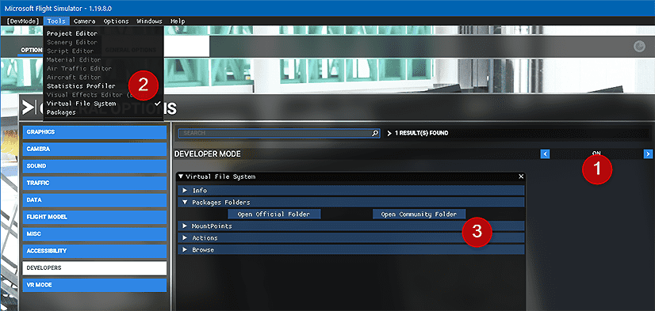
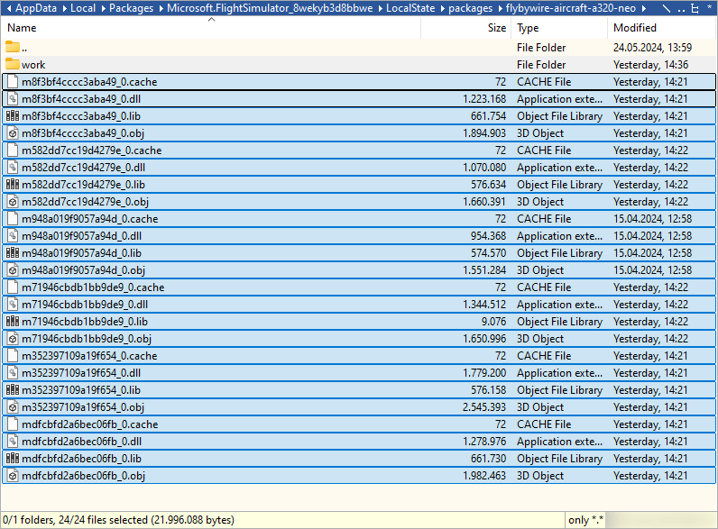

# Installation Guide

Please follow the information on this page to install FlyByWire Simulations products for Microsoft Flight Simulator 2020.

---

## Downloads

### FlyByWire Installer

Download the new FlyByWire installer where you can select either the Stable, or Development build. Our installer downloads and installs the add-on directly into your community folder.

The following commands can be used:

++ctrl+f5++ - Refreshes Installer

++ctrl+f12++ - Opens the debug tool

#### Installer Debug Logs

You can send us logs to our [Discord](https://discord.gg/flybywire){target=new} for support if you encounter issues with the installer. Please follow the steps below:

  * Open the debug tool ++ctrl+f12++.

  * Find and select ++"Console"++ in the top menu.

  * ++"Right Click"++ anywhere in the log displayed.

  * Click ++"Save as"++ and send the log to us.

[Download Installer](https://api.flybywiresim.com/installer){ .md-button target=new}

### Manual Installation

- **Download A32NX**

    ---

    === "Stable Version"

        **Current Stable Version -** 

          Stable is our variant that has the least bugs and best performance. This version will not always be up-to-date, but we guarantee its compatibility with each major patch from MSFS. 

          [Download Stable](https://github.com/flybywiresim/aircraft/releases/download/assets/stable/A32NX-stable.zip){.md-button target=new}

          Latest release notes: [View Here](/latest-release/)

    === "Development Version"

        Development will have the latest features that will end up in the next stable. Bugs are to be expected. 

        It updates whenever something is added to the 'master' branch on GitHub. 

         [Download Development](https://github.com/flybywiresim/aircraft/releases/download/assets/master/A32NX-master.7z){.md-button target=new}
         
         **IMPORTANT:** 

        View information on Autopilot / Fly-By-Wire [here](../a32nx/feature-guides/autopilot-fbw.md)

- **Download A380X**

    ---

    Download via our Installer.

    [Download Installer](https://api.flybywiresim.com/installer){ .md-button target=new}

[//]: # (    === "Experimental Version")

[//]: # ()
[//]: # (        This version is similar to the development version, but contains custom systems early in the development phase - expect issues.)

[//]: # ()
[//]: # (        To see what features are being tested in our experimental version, please read [Experimental Version Support )

[//]: # (        Page]&#40;support/exp.md&#41; before using this version.)

[//]: # (    )
[//]: # (        It will be updated with the latest changes to the development version every week or so while new major features are tested &#40;not guaranteed&#41;.)

[//]: # ()
[//]: # (        [Download Experimental]&#40;https://github.com/flybywiresim/aircraft/releases/download/assets/experimental/A32NX-experimental.zip&#41;{.md-button target=new})

[//]: # ()
[//]: # (        !!! danger "No Support for Experimental - use at own risk")

[//]: # (            Please do not seek support for the Experimental Version on Discord, and only report issues if you have read this page and the reported and known issues.)

---

**Please follow ALL steps in this section if you encounter any issues with installation before seeking support.**

Open the zip that you downloaded from one of the links above, and drag the `flybywire-aircraft-a320-neo` or 
`flybywire-aircraft-a380-842` folder inside the zip into your Community folder.

See below for the location of your Community folder.

## Community Folder

### Microsoft Store and/or Game Pass Edition

- Copy the `flybywire-aircraft-a320-neo` or `flybywire-aircraft-a380-842` folder into your community package folder.

It is located in:

* `C:\Users\[YOURUSERNAME]\AppData\Local\Packages\Microsoft.FlightSimulator_<RANDOMLETTERS>\LocalCache\Packages\Community`.

---

### Steam Edition

- Copy the `flybywire-aircraft-a320-neo` or `flybywire-aircraft-a380-842` folder into your community package folder.

It is located in:

* `C:\Users\[YOUR USERNAME]\AppData\Roaming\Microsoft Flight Simulator\Packages\Community`.

---

### Boxed Edition

- Copy the `flybywire-aircraft-a320-neo` or `flybywire-aircraft-a380-842` folder into your community package folder.

It is located in:

* `C:\Users\[YOUR USERNAME]\AppData\Local\MSFSPackages\Community`.

---

### Troubleshooting

If the above methods do not work:

To find the Community folder that MSFS is using, please follow these steps:

1. Go to your General Settings in MSFS and activate Developer Mode.
2. Go to the menu and select 'Virtual File System'.
3. Click on 'Packages Folders' and select 'Open Community Folder'.

This opens the Community folder in a Windows Explorer. Please ensure that your add-ons are installed in the folder that is opened.

---

If your issue is not related to installation visit - [**Reported Issues**](../support/known-issues/known-issues)

---

## Clean Install Steps

### Automatic Clean Install

FBW Installer version 3.0.0 introduced the `Uninstall` feature. To perform an automatic clean install:

- Ensure you have the latest FBW Installer on your machine. 
    - The installer updates itself. If you would like to download our installer again, see the [FlyByWire Installer Section](#flybywire-installer).
- Click on the "Uninstall" button.

!!! tip ""
    This removes the aircraft from your community folder and the extra files in `%appdata` or `%localappdata`.

    Your `Work` folder is retained to save your throttle configuration, FDR files, and any other presets we save. 
    (These are small files and do not need to be deleted to fulfill a "clean install" state.)

### Manual Clean Install

If you would like to manually perform a clean install you first have to delete the 
`flybywire-aircraft-a320-neo` or `flybywire-aircraft-a380-842` folder from your community folder.

We also store additional information related to the aircraft in a separate directory, which is built when you load the 
aircraft in the simulator. You also need to delete the contents of this folder, but not the folder itself. 

These locations are found below:

- [Microsoft Store Version](#microsoft-store-version)
- [Steam Version](#steam-version)

If the above folders are hidden to you, follow the directions on 
[Microsoft's support site](https://support.microsoft.com/en-us/windows/view-hidden-files-and-folders-in-windows-10-97fbc472-c603-9d90-91d0-1166d1d9f4b5).

Once in the correct directory, delete all files in the folder but maybe leave the `work` folder:

!!! info "Work Folder"
    The locations below contain a "work" folder. We store important things here that you may not want to delete:

    - Your EFB throttle configuration.
    - Your FDR files (for debugging purposes, which we may ask you to provide).
    - Your lighting presets.
    - Your last fuel tank levels.
    - Your flight model configuration (if you have changed it).

    **It is up to you to keep this folder or not.**

#### Microsoft Store Version

The folder can be found here:

A32NX: 
`%LOCALAPPDATA%\Packages\Microsoft.FlightSimulator_8wekyb3d8bbwe\LocalState\packages\flybywire-aircraft-a320-neo\`

A380X: 
`%LOCALAPPDATA%\Packages\Microsoft.FlightSimulator_8wekyb3d8bbwe\LocalState\packages\flybywire-aircraft-a380-842\`

To quickly locate the `%localappdata%`:

- Press start
- Type in run into the start menu and press ++enter++
- Type into the box `%localappdata%`
- Press ++"OK"++

!!! warning ""
    This is not your community directory

#### Steam Version

The folder can be found here:

A32NX: 
`%APPDATA%\Microsoft Flight Simulator\Packages\flybywire-aircraft-a320-neo\`

A380X: 
`%APPDATA%\Microsoft Flight Simulator\Packages\flybywire-aircraft-a380-842\`

To quickly locate `%appdata%`:

- Press start
- Type in run into the start menu and press ++enter++
- Type into the box `%appdata%`
- Press ++"OK"++

!!! warning ""
    This is not your community directory

***

## Recommended Settings for A32NX, A380X, MSFS and Windows

See [Recommended Settings](settings.md).

## Estimated System Requirements for A380X

**Minimum (1080p30 Low)**

* CPU: Intel i5-4460 or Ryzen 3 1400
* GPU: Nvidia GTX 1060 6GB or AMD RX 480 8GB
* Memory: 8GB
* Storage: 28GB* free space (HDD or SSD)

**At least 4-8GB needed for pagefile (virtual memory)*

**Recommended (1440p30 High)**

* CPU: Intel i5-8400 or Ryzen 5 3600
* GPU: Nvidia RTX 3060 12GB or AMD RX 6600 XT 8GB
* Memory: 16GB
* Storage: 20GB free space (SSD)

**Flying By Wire (1440p/4k DLSS 60 High/Ultra)**

* CPU: Ryzen 7 7800X3D
* GPU: RTX 4080 Super 16GB or 7900 XTX 24GB
* Memory: 32GB
* Storage: 20GB free space (SSD)

## Contributing

More info [FlyByWire Development Overview](../../dev-corner/dev-guide/index.md) or
[:fontawesome-brands-github:{: .github } **GitHub Contributing.md**](https://github.com/flybywiresim/aircraft/blob/master/.github/Contributing.md){target=new }

***

## SimBrief Airframe

A32NX: 
[SimBrief Integration Guide](../a32nx/feature-guides/simbrief.md){.md-button}

A380X: 
[SimBrief Integration Guide](../a380x/feature-guides/simbrief.md){.md-button}

We have moved this information to the location above.
